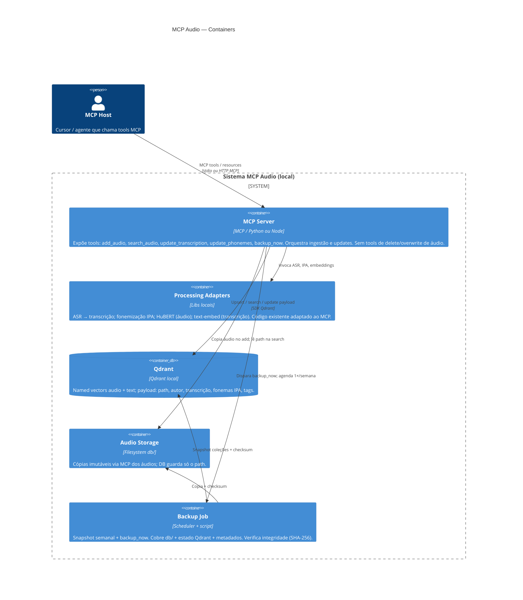

# C4 Containers — MCP Audio / Qdrant

Nível: **Containers**. Escopo: MCP Server local para ingestão, busca e atualização de metadados de áudio (transcrição + fonemas IPA), com Qdrant, storage em `db/` e backup.

**Restrição transversal:** nenhuma tool MCP exclui ou sobrescreve arquivos de áudio.

---

## Diagrama C4 Containers

### Notas do desenho

| Container | Responsabilidade | Não faz |
|-----------|------------------|---------|
| MCP Host | Consome tools | Não acessa Qdrant/storage diretamente neste desenho |
| MCP Server | Contrato MCP; orquestra fluxos; reindex após update de texto | Delete/modify de áudio; devolver binário na search |
| Processing Adapters | Transcrição, IPA, HuBERT, text-embed | Persistência |
| Qdrant | Vetores + metadados; filtro por autor | Dono do binário |
| Audio Storage (`db/`) | Persistência dos arquivos | Mutação exposta a agentes |
| Backup Job | Backup completo + verificação de integridade | Apagar áudios de produção |

### Fluxos principais (referência)

1. **`add_audio`:** Host envia áudio → MCP copia para `db/` → Processing (ASR + IPA + HuBERT + text-embed) → upsert Qdrant (path + payload + named vectors).
2. **`search_audio`:** query texto e/ou áudio → embed → busca em named vector(s) → retorna metadados + path (sem binário); filtro opcional por autor.
3. **`update_transcription`:** atualiza payload → recalcula text-embed → reindex no Qdrant.
4. **`update_phonemes`:** atualiza IPA no payload (sem tocar áudio nem, por padrão, o vetor de áudio).
5. **`backup_now` / semanal:** Backup Job espelha `db/` + snapshot Qdrant + manifesto de checksums; valida integridade.

---

## Lacunas residuais — decisões fechadas

| Tópico | Decisão |
|--------|---------|
| Destino do backup | Pasta local `backup/` (espelho versionado por data `backup/YYYY-MM-DD/`), contendo cópia de `db/` + export/snapshot das coleções Qdrant + `MANIFEST.sha256`. |
| Integridade | Após cada backup (agendado ou `backup_now`), recalcular SHA-256 de todos os arquivos copiados e comparar com o manifesto; falha → reportar erro na tool / log, não apagar origem. |
| Text-embed / ASR / IPA | Interfaces de adapter no Processing; implementação = código já existente do usuário (HuBERT fixo para áudio; modelo de texto e ASR/fonemizador plugados sem amarrar marca no C4). |
| Áudio muda | Nenhuma tool MCP altera o binário. Se o arquivo em `db/` for substituído fora do agente (ops manual), um procedimento interno de reindex (HuBERT + eventual text se acoplado) deve rodar — **não** exposto como tool destrutiva ao agente. |
| Fusão texto + áudio na search | Qdrant **named vectors** `audio` e `text`. `search_audio` aceita modalidade `text`, `audio` ou `both`. Em `both`, fusão por **RRF (Reciprocal Rank Fusion)** sobre os dois rankings; filtro de payload `autor` aplicado em todas as modalidades. |
| Nomes de tools | Canônico: `add_audio`, `search_audio`, `update_transcription`, `update_phonemes`, `backup_now`. Pipeline de transcrição/fonema/embed vive **dentro** de `add_audio`. Itens futuros (fora do C4 atual): `add_audio_metadata`, `update_audio_tags`, resources de categorias. |

---

## Fora de escopo deste documento

- Diagrama de Components / Code
- ACL de filesystem / WORM
- Devolução de binário na search
- Resources de categorias no MCP
