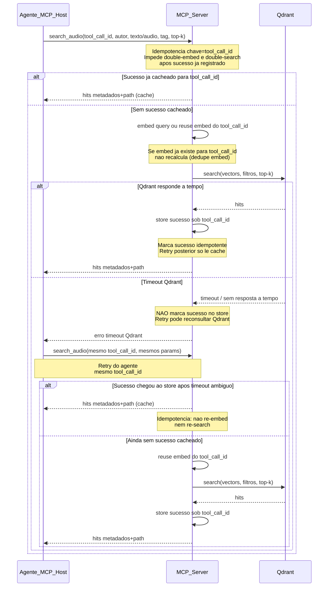

# Diagrama de sequência — `search_audio`

Tipo: **comportamental**. Notação: **Mermaid `sequenceDiagram`**. Escopo: busca de áudios no MCP Audio (filtro por autor, texto e/ou áudio, tag, top-k).

---

## 1) Lacunas fechadas

| Tópico | Decisão |
|--------|---------|
| Domínio | MCP Audio (não pedido/pagamento) |
| Cenário | Único: `search_audio` |
| Timeout do provedor | **Qdrant** (sem SLA numérico inventado) |
| Participantes | Agente (MCP Host), MCP Server, Qdrant |
| Embed da query | Dentro do MCP Server (Processing sem lifeline) |
| Idempotência | Chave = `tool_call_id` (dedupe de embed + dedupe de search) |
| Retry | Agente reenvia a tool call com o **mesmo** `tool_call_id` |
| Params | `autor`, `texto` e/ou `audio`, `tag`, `top-k` |
| Resposta | Metadados + path; **sem** binário |

---

## 2) Roteiro revisado

1. O **Agente** invoca `search_audio` com `tool_call_id`, `autor`, query (`texto` e/ou `audio`), `tag` e `top-k`.
2. O **MCP Server** valida os parâmetros e consulta o store de idempotência por `tool_call_id`.
3. Se já existir **sucesso** cacheado para esse id, devolve a resposta memorizada (sem novo embed nem nova busca).
4. Caso contrário, gera embed da query **ou** reutiliza embed já associado ao mesmo `tool_call_id` (evita double-embed em retry).
5. MCP chama **Qdrant** (named vectors / filtros: autor, tag; top-k).
6. **Sucesso:** Qdrant retorna hits; MCP monta metadados + paths, **registra sucesso** sob `tool_call_id` e responde ao Agente.
7. **Falha realista:** Qdrant **timeout** (ou resposta não chega a tempo); MCP devolve erro ao Agente e **não** marca sucesso no store de idempotência.
8. O Agente **retenta** com o **mesmo** `tool_call_id`.
9. Se o 1º search no Qdrant tiver completado “atrás” do timeout e o MCP já tiver gravado sucesso, o retry curto-circuita no cache (idempotente).
10. Se não houver sucesso cacheado, MCP pode reconsultar Qdrant; embed só recalcula se ainda não estiver ligado ao `tool_call_id`.
11. Condição de sucesso do cenário: hits (ou lista vazia válida) entregues ao Agente com o mesmo contrato (metadados + path).
12. Fora de escopo neste diagrama: `add_audio`, updates, backup, delete de áudio.

---

## 3) Mermaid — sequência `search_audio`

---

## 4) Checklist de PR

- [ ] Ordem: Agente → MCP → (embed interno) → Qdrant → resposta; retry só pelo Agente.
- [ ] Caminho de falha explícito: **timeout Qdrant** (sem inventar SLA).
- [ ] Retry usa o **mesmo** `tool_call_id` e os mesmos parâmetros semânticos.
- [ ] Em cada retry fica claro o mecanismo anti-duplicação: store por `tool_call_id`.
- [ ] Sucesso cacheado: não reprocessa embed nem reenvia search.
- [ ] Timeout **não** grava sucesso no store (evita falso positivo e permite retentar search).
- [ ] Timeout ambíguo (Qdrant concluiu, cliente viu timeout): retry lê cache se sucesso já registrado.
- [ ] Embed dedupe: embed só recalcula se ainda não houver associação ao `tool_call_id`.
- [ ] Busca é só leitura em Qdrant; **sem** delete/overwrite de áudio neste fluxo.
- [ ] Resposta: metadados + path; **sem** binário.
- [ ] Filtros cobertos: autor, texto e/ou áudio, tag, top-k.
- [ ] Observabilidade mínima: log de `tool_call_id`, outcome (`success`/`timeout`/`cache_hit`), e se embed/search foram skipped por idempotência.
